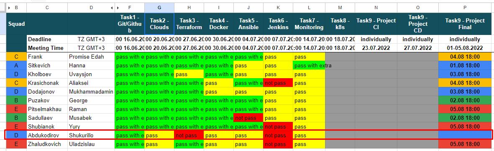

# Table of Contents
- [Table of Contents](#table-of-contents)
    - [Hi ✌️](#hi-️)
    - [My Resume](#my-resume)
    - [My first experience: 2019 - 2021](#my-first-experience-2019---2021)
      - [SOS - sos.uz](#sos---sosuz)
      - [Tasks:](#tasks)
    - [My second experience: 2021 - 2022](#my-second-experience-2021---2022)
      - [IT-MED - itmed.uz](#it-med---itmeduz)
      - [Tasks:](#tasks-1)
    - [My third experience: 2022 - present](#my-third-experience-2022---present)
      - [PROJECT-LAB- projectlab.uz](#project-lab--projectlabuz)
      - [Tasks:](#tasks-2)
    - [Internships:](#internships)
      - [Exadel](#exadel)
      - [Ivis](#ivis)

   

### Hi ✌️
>My name is Shukurillo Abdukodirov. 
>I am 25 years old. 
>I have 5+ years experience as ***backend developer***.
>

### My Resume
You can download it from here.

### My first experience: 2019 - 2021

#### SOS - [sos.uz](https://sos.uz)

The SOS (Smart Outsourcing Solutions) company develops websites, mobile applications, website promotion and advertising design. The company cooperates with many successful domestic companies and enterprises. We have also established multifaceted and successful cooperation with many foreign companies from Australia, USA, UAE, etc.

#### Tasks:
Related to the development and support of web applications for medium and large businesses...

### My second experience: 2021 - 2022

#### IT-MED - [itmed.uz](https://itmed.uz)

The IT-MED State Unit is the responsible institution of the Ministry of Health of the Republic of Uzbekistan for the issues of implementation and development of information and communication technologies, telemedicine, and distance learning.

#### Tasks:
Related to the development and support of a web application that serves the employees of 1000+ hospitals under the Ministry of Health of the Republic of Uzbekistan and their clients.

### My third experience: 2022 - present

#### PROJECT-LAB- [projectlab.uz](http://projectlab.uz)

The Project Management Center in the labor sector is a team of professionals with 20 years of experience in project management and digitalization of labor relations. The Center was established in 1995 as the main IT department of the Ministry of Labor and expanded its activities in 2020 as a Project Office.

#### Tasks:
Related to the development and support of the "Single National Labor System" platform for organizations and citizens operating in the Republic of Uzbekistan.

### Internships:

#### [Exadel](https://exadel.com)
- Learned basic fundamentals of devops
- Build complete CI/CD pipeline as final project
**Reference:** [Results of List of Success DevOps - Jul 2022](https://docs.google.com/spreadsheets/d/1s-MVV-ZdlIWqasnrqK7yCUJNmwHcvDX4b66dsHE1JlI/edit#gid=0)

#### [Ivis](https://ivis.ai)
- Build a service with Apache/Kafka stream for real time data exchange.
- Prepared project plan and managed task process flow.
**Reference:** [Project Plan](https://docs.google.com/spreadsheets/d/1aAS5nh4K5AE_cWpH6yG_-_p5YnGcT4XI/edit#gid=2082212453)

